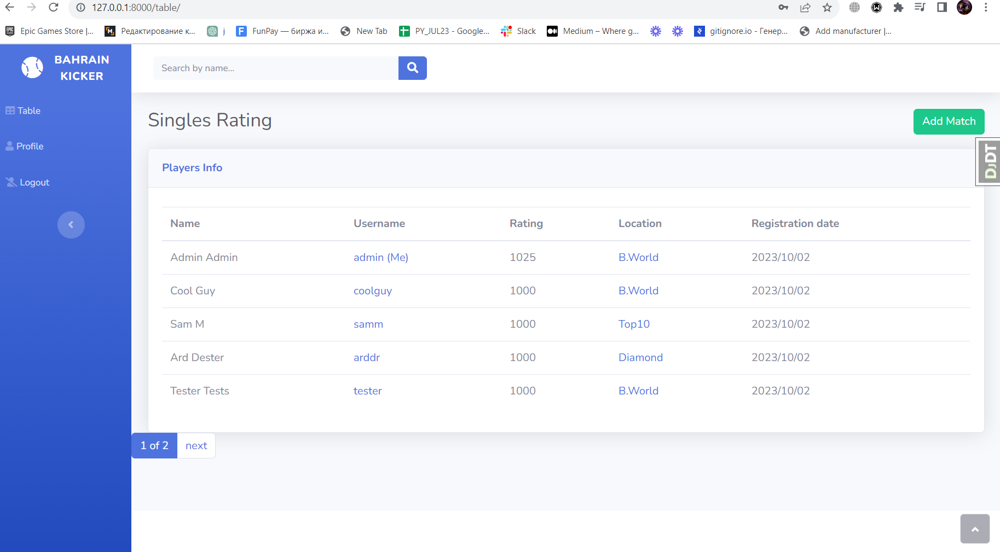

# Bahrain Kicker Rating WebApp
> A web-application that calculates ratings and records the results of official matches

## Check it out!

[Kicker project deployed to Render](https://bahrain-kicker-rating.onrender.com/)

A convenient and easy panel for viewing the overall rating and adding match results, 
designed to increase interest and create a tournament format for matches.

## Installing / Getting started

Python 3 Must be installed

```shell
git clone https://github.com/ORENYT/bh-kicker-rating-webapp
cd bh-kicker-rating-webapp
python3 -m venv venv
source venv/bin/activate #Linux
.\venv\Scripts\Activate.ps1 #Windows
pip install -r requirements.txt
python manage.py migrate
python manage.py runserver #Run Django Project
```

## Features

* Register and login, manage your profile data
* Add match results, if you are an admin
* Check your results in global region table


## Demo

